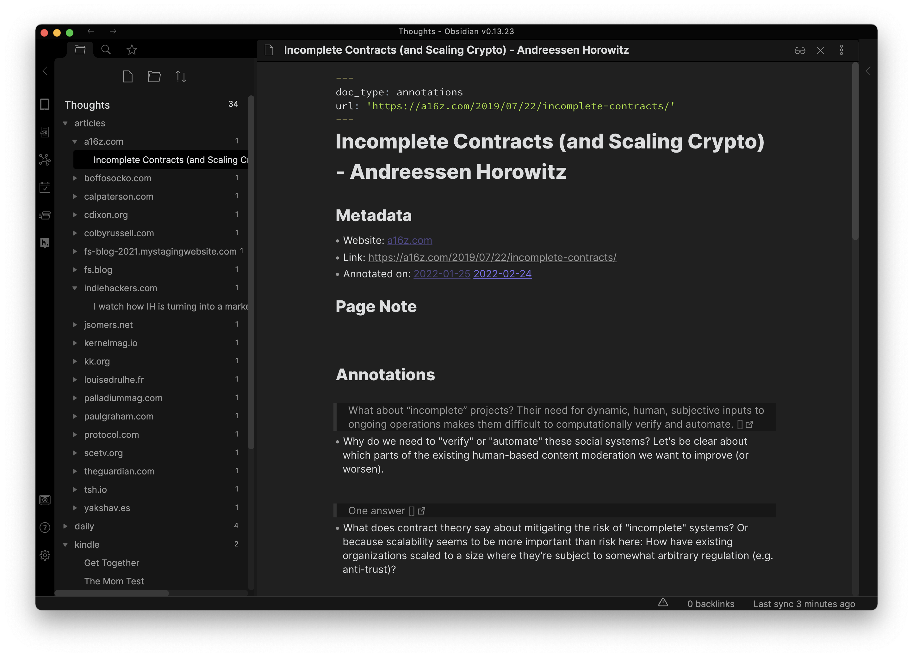

## Obsidian Annotations Plugin

Integrate web annotations into your Obsidian notes. Your [Hypothesis](https://web.hypothes.is) annotations turn up as files, and your local edits turn up on the web.

## Usage

1. Annotate or highlight articles you come across.
2. These highlights will turn up in your Obsidian notes.
3. Any edits to these local files will be uploaded to Hypothes.is.

## Installation

1. Create a free [Hypothes.is](https://web.hypothes.is) account and install their open-source browser extension.
2. Install this [Obsidian](https://obsidian.md) plugin via the Community Plugins store.
3. Generate your Hypothes.is developer token and enter it on the plugin settings page.

## Customization

See the Obisidian plugin settings page for details.

## Acknowledgement

This project expands, and adds bi-directional synchronization to Wei Chen's [Hypothes.is Plugin](https://github.com/weichenw/obsidian-hypothesis-plugin). Which in turn is inspired by Hady Ozman's [Kindle Plugin](https://github.com/hadynz/obsidian-kindle-plugin).
